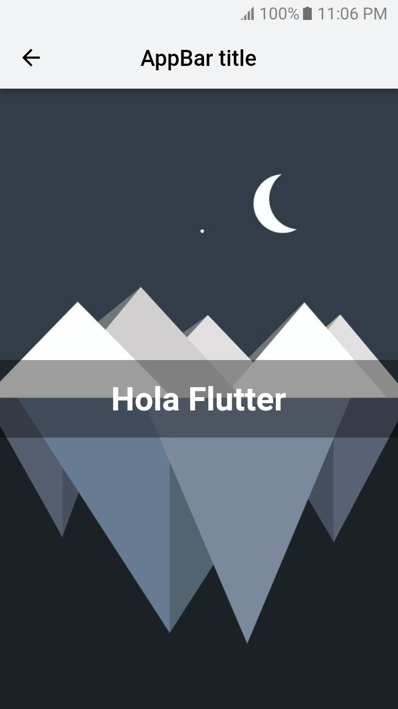

<h1 align="center"> Flutter Stack </h1>

Stack is a widget in Flutter that allows you to overlay multiple widgets on a single screen and display them from bottom to top. Therefore, the first widget is the bottom element and the last widget is the top element.

## And I also answer the questions

- How to make Status Bar transparent?
- How to remove DEBUG banner in Flutter App?
- How to change AppBar background color in Flutter App?
- How to add icon to AppBar in Flutter App?

## License

- This project is under the MIT License.

---

&#x1F468;&#x200D;&#x1F4BB; with &#x1F499; by <a href="https://github.com/luigidelcarpio">Luigi del Carpio</a>.

